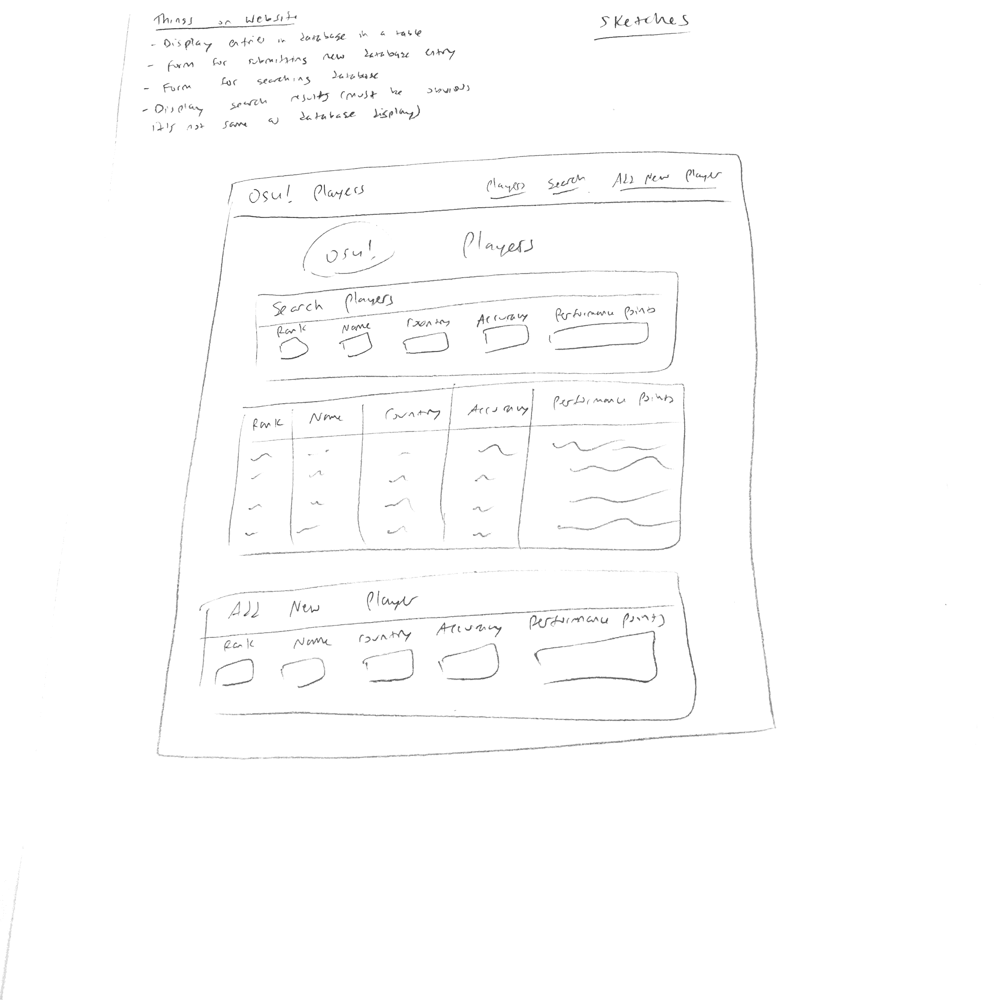
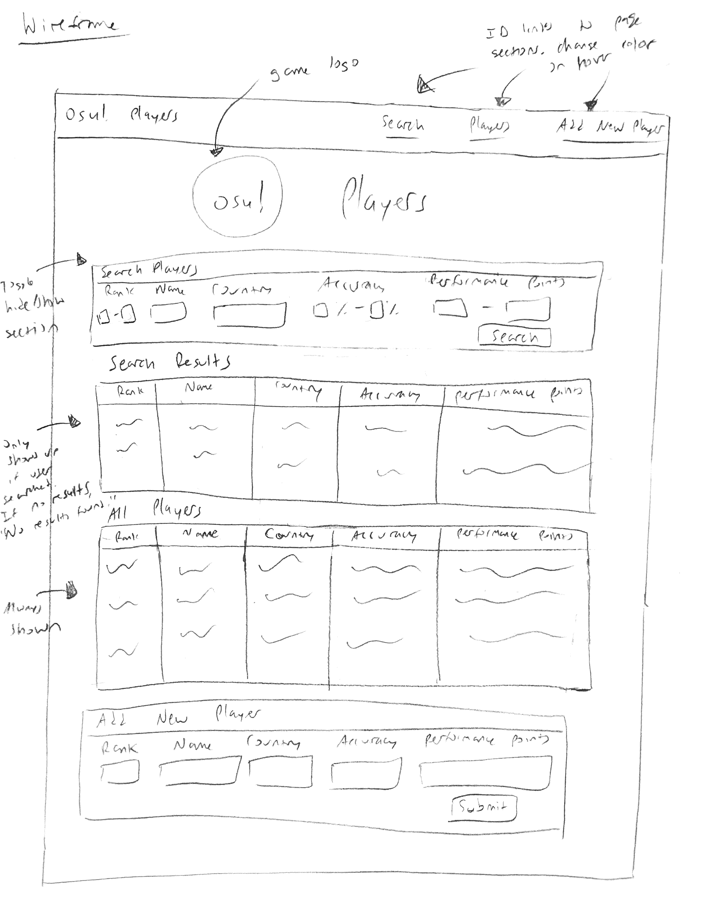

# Project 2, Milestone 1 - Design & Plan

Your Name: William Wang

## 1. Persona

I've selected **Patricia** as my persona.

I chose Patricia as my persona because she tends to avoid spending her free time
exploring new technology and learning how to do new things. If she feels more
familiar with something else Patricia will likely choose to use that over something
new. This means to help target my website design to people like her it should look
like something that is already familiar or is easy to use without much figuring things
out on her own. If the website is unfamiliar and not immediately obvious how to use it,
Patricia will be more likely to not use the website and try to use something else.

## 2.Describe your Catalog

My catalog will be statistics about players in a rhythm game called osu!. The
attributes each player will have are:
* Global Rank
* Country
* Player Name
* Accuracy
* Performance Points

## 3. Sketch & Wireframe




My design is effective for my persona because it has a menu at the top that
will put you directly at the start of the three sections of the web page: the
search form, catalog display, and new entry form. This makes it easy for Patricia
to get where she wants quickly and easily without a lot of scrolling, especially
if the catalog has a lot of entries. You can toggle showing or hiding the search form
so it reduces the clutter on the website. You only have to see the search form when you
want to see those sections and use them. The search results section also only shows
up when the user actually searches something and tell the user when there are no
search results or when they didn't input any search parameters. The search results and
main catalog display are also clearly labeled so the user can tell which is which. The main focus
of the website is to display the catalog of osu! players so that will be most of the
content of the website seen by the user initially. This means the content of the website will
be instantly familiar to Patricia because the table will be obvious and clearly
labeled, with the extra forms labeled clearly as well so there is no ambiguity as
to what something does.

## 4. Database Schema Design

Table: players
* id: PRIMARY KEY, AUTO INCREMENT, NOT NULL, INTEGER, UNIQUE
* rank: UNIQUE, NOT NULL, INTEGER (must be >= 1) - global rank of player on leaderboards
* name: UNIQUE, NOT NULL, TEXT - player username
* country: NOT NULL, TEXT - player country of origin
* accuracy: REAL (must be >= 0 and <= 100), NOT NULL, DEFAULT 0 - average accuracy of player
* pp: INTEGER (must be >= 0), NOT NULL, DEFAULT 0 - total performance points of player

## 5. Database Query Plan

1. All records
  * SELECT rank, name, country, accuracy, pp FROM players;

2. Search records by user selected field
  * SELECT * FROM players WHERE (rank >= [user input]) AND (rank <= [user input]);
  * SELECT * FROM players WHERE name LIKE '%[user input]%';
  * SELECT * FROM players WHERE country = [user input]';
  * SELECT * FROM players WHERE (accuracy >= [user input]) AND (accuracy <= [user input]);
  * SELECT * FROM players WHERE (pp >= [user input]) AND (pp <= [user input]);

Combine these queries based on what fields were filled out by the user in the form.

3. Insert record
  * INSERT INTO players (rank, name, country, accuracy, pp) VALUES (input_rank, 'name',
    'country', input_accuracy, input_pp);

## 6. *Filter Input, Escape Output* Plan

* Make everything a required field for the add new player form
* Always use htmlspecialchars() before outputting it into HTML table or using in
  SQL query.
* Use *$db->prepare()* to prevent SQL injection and make sure to use :var to escape it
  in the SQL query.
* Make sure *$client_rank* is >= 1 in the HTML form constraints, if not default to 0
  in the database.
  * Use FILTER_VALIDATE_INT
* Make sure *$client_name* is not null, default to empty string, maximum 50 characters
  * Use FILTER_SANITIZE_STRING
* Make sure *$client_country* is not null, default to empty string, maximum 50 characters
  * Use FILTER_SANITIZE_STRING
* Make sure *$client_accuracy* is between 0 and 100 inclusive, if not default to 0
  * Use FILTER_VALIDATE_FLOAT
* Make sure *$client_pp* is >=0 in the HTML form constraints, if not default to 0
  * Use FILTER_VALIDATE_INT

## 7. Additional Code Planning

* If search form has no values in the fields when submitted (under if statement with
  if (isset($\_GET["submit"])), use *!empty()* and check that you don't have all the fields empty),
  print out "Missing search parameters or invalid search query." on page.
  * Check if valid country name and if other fields are nonempty/valid if (isset($\_POST["submit"]))
    is true. If invalid fields or empty fields print out "Invalid player data." on page
* If no returned results, print out "No players matching search query found." on page
* Don't forget to name user input variables with a client_[variable name]
* Have PHP includes for the header, similar to header from project 1
* Make the HTML table header row have a different color. Alternate colors between
  each row entry to enhance readability. Refer to implemented solution in Lab 2.
* Make function for the database queries in SQL
```
function get_records($db, $sql, $params) {
    $query = $db->prepare($sql);
    if ($query and $query->execute($params)) {
      $records = $query->fetchAll(PDO::FETCH_ASSOC);
      return $records;
    }
    return NULL;
}
```
* Make function that forms the *$sql* string query for the search form field inputs
  * If the min/max rank search field is set, add (rank >= [user input]) AND (rank <= [user input])
    to the where part of search query string. Default min rank is 1, default max rank is PHP_INT_MAX
    if one of min/max is set but the other isn't.
  * If the name search field is set, add (name LIKE '%[user input]%') to the string
  * If the country search field is set, add (country LIKE '%[user input]%') to the string
  * If the min/max accuracy search field is set, add (accuracy >= [user input]) AND (accuracy <= [user input])
    to the string. Default min accuracy is 0, default max accuracy is 100 if one of
    min/max accuracy is set but the other isn't.
  * If the min/max performance points search field is set, add (pp >= [user input]) AND (pp <= [user input])
    to the where part of search query string. Default min pp is 0, default max pp is PHP_INT_MAX
    if one of min/max is set but the other isn't.
  * If the field is not set, don't add it to the SQL query string
